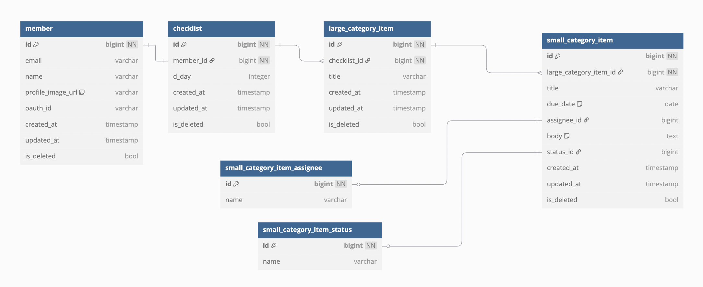

## 프로젝트 설명
- 결혼 준비를 도와주는 웹 서비스

## 사용 기술
- SpringBoot, Java, Gradle, Mybatis, MySQL, Mockito, GithubAction, Git, EC2, S3

## ERD

## 접근 가능 url
### 웹앱
- https://weddy-smoky.vercel.app/

### swagger 문서
- https://your-weddy.pe.kr/swagger-ui/index.html

